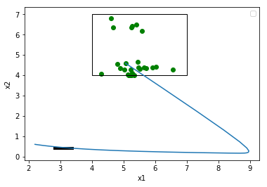

# NeuralExplorer

State Space Exploration of ClosedLoop Control Systems Using Neural Networks.

## Introduction
The software first approximates the sensitivity and inverse sensitivity functions using neural network.
Then, these neural networks are used to falsify a given system or derive system simulations for reachability.
The examples in this tutorial primarily focus on inverse sensitivity; the application and usage in the context 
of forward sensitivity follows directly.

### Prerequisites and installation

* python3.0

* Jupyter notebook

* keras

* numpy

* matplotlib

* itertools

* tensorflow

* sklearn


## Running the tests

All experiments are organized in different notebooks located in eval-notebooks directory under 'eval' folder.
The user can look at these notebooks to understand their utility and run their own tests.
Although notebook titles are self explanatory, some of their descriptions are given below.

* Runs corresponding to basic algorithm 'reachTarget' for reaching a given state using inverse sensitivity

<p align="center">  </p>

```
eval-inv-sen-basic
```

* Runs where basic algorithm is performed multiple times and mean of their results is computed.

```
eval-inv-sen-avg
```

* Runs to perform falsification (given an unsafe set) using inverse sensitivity

<p align="center">  </p>

```
eval-inv-sen-falsification
```

* In order to generate the corresponding point cloud based on distance profiles, one can look at the runs in

<p align="center">  </p>

```
eval-fwd-sen-falsify-point-cloud
```

* Runs to perform reachability using forward sensitivity


```eval-fwd-sen-reachability```

## Authors

* **Manish Goyal** - *Initial work* - [PurpleBooth](https://github.com/mag16154)


## License

This project is licensed under the MIT License - see the [LICENSE.md](LICENSE.md) file for details

